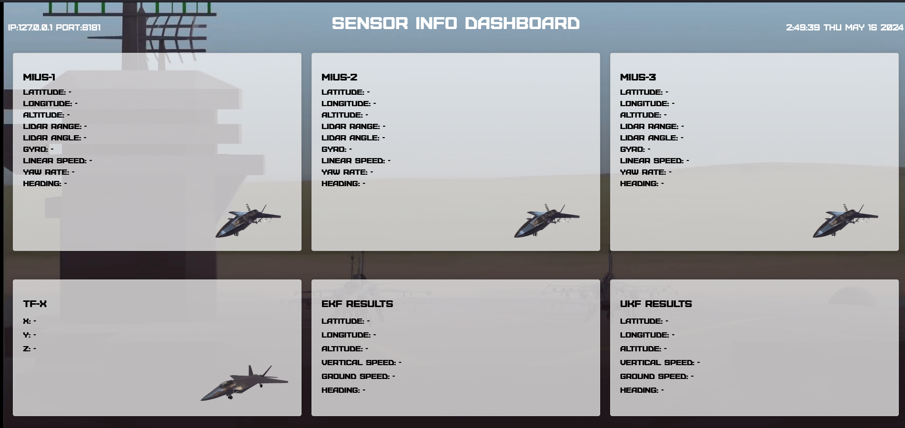
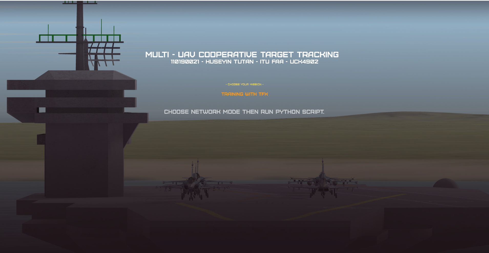
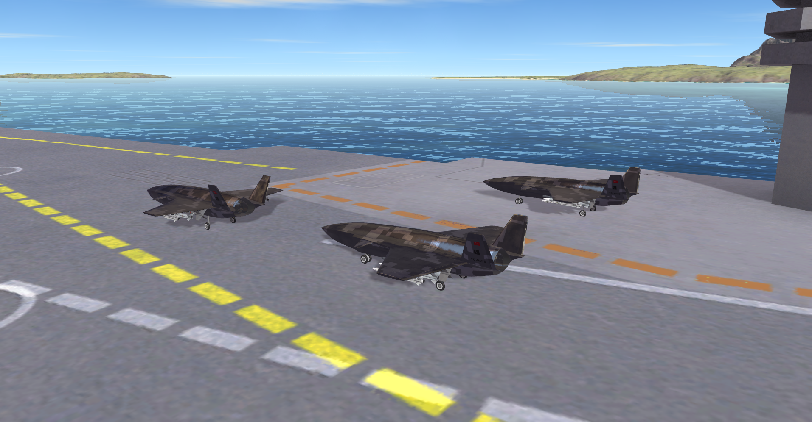
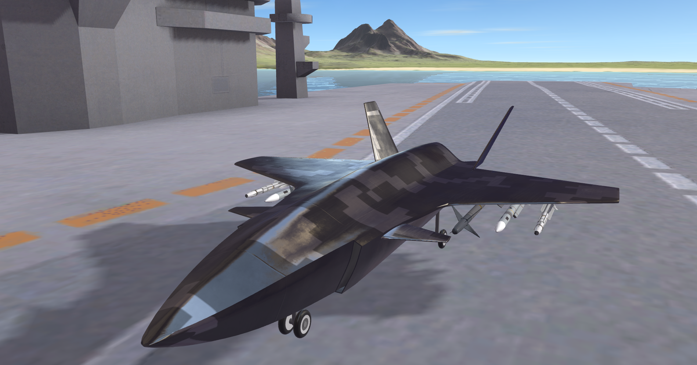
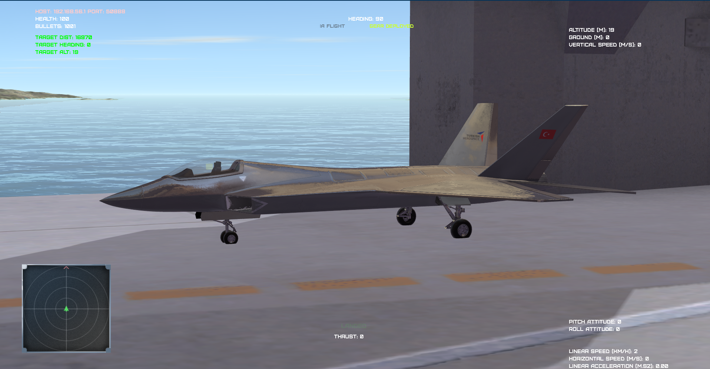
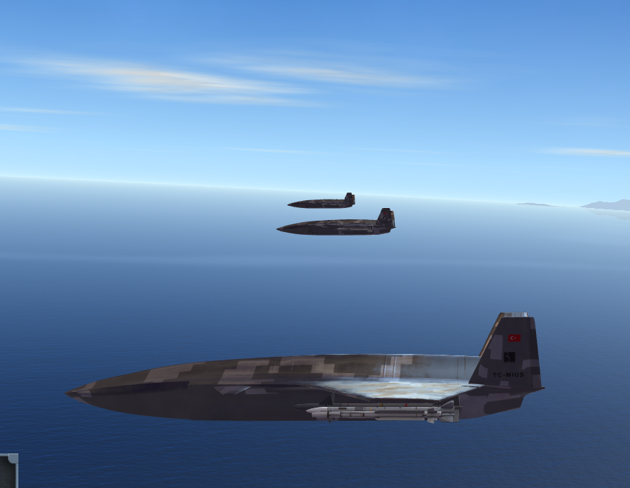

# Multi-UAV Cooperative Target Tracking

This repository has been created using Dogfight Sandbox. Visit sandbox's GitHub page: https://github.com/harfang3d/dogfight-sandbox-hg2.

---

This repository contains the codes I prepared for the graduation study prepared within the scope of the UCK4901-UCK4902 courses, which are the Istanbul Technical University Aeronautical Engineering graduation project courses.

The research subject of the project is to jointly use the sensor data of many unmanned aerial vehicles (fixed wing) to more accurately estimate the position of the target aircraft they are tracking with a filter approach. Python3-based Harfang Dogfight Sandbox, which can be used on 3 major operating systems, was used as the simulation environment. In the simulation scenario, there are three friendly UAVs and 1 enemy fighter jet. Vehicles taking off from different aircraft carriers produce high-frequency GPS, IMU and Lidar sensor data. The outputs of these sensors are visualized in the browser via port 8181 to a web interface created with Flask and UDP socket.


### Prerequisites
- Python 3+
- Flask
- harfang==3.2.5
- tqdm
- pyproj
- pypubsub

### Installation

1. Clon the repository.
   ```sh
   git clone https://github.com/huseyintutan/Multi-UAV-Cooperative-Target-Tracking
   ```

2. Run 0-install-requirements.bat file.

3. Run 1-start.bat file.

The startup screen looks like this:


4. Just press a random key in your keyboard. 

5. Run the network python script named as "client_sample.py".
    ```sh
    python3.10.exe .\client_sample.py
    ```
6. Run the dashboard python script named as "client_sample.py".
    ```sh
    python3.10.exe .\client_sample.py
    ```

7. To open dashboard go to URL:127.0.0.1/8181 with any browser.







